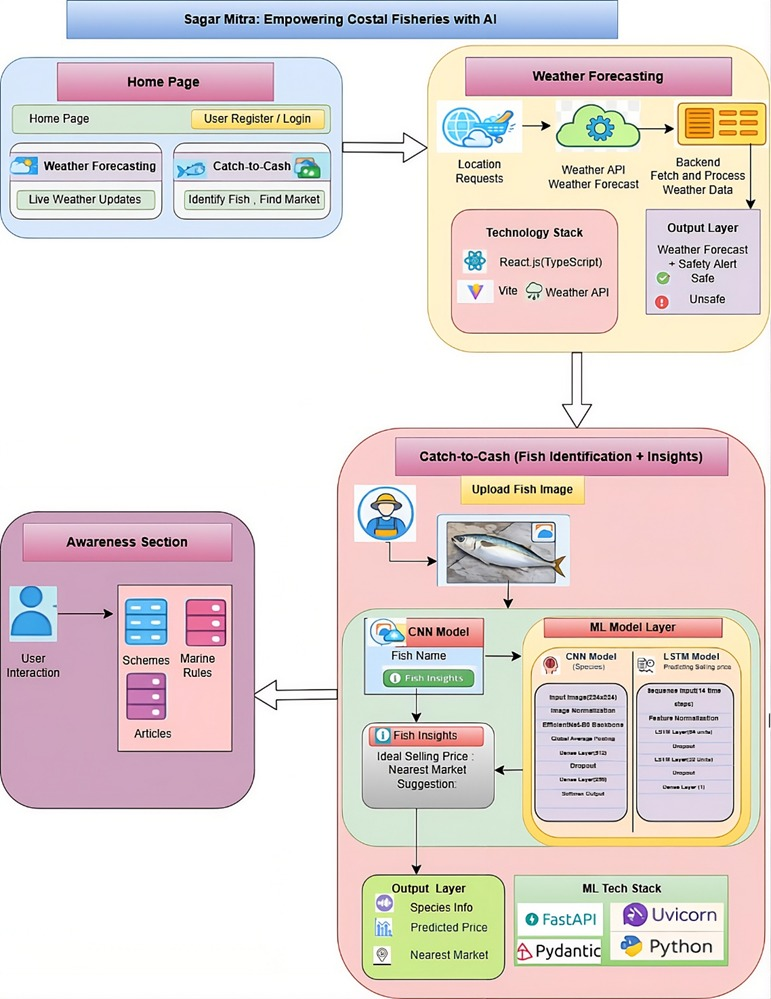

# 🌊 SagarMitra — AI-Powered Fishermen Companion  
### *समुद्र का साथी · Your Smart Companion at Sea*  

<p align="center">
  
  
  
  
  
</p>

---

## 🚀 Overview

**SagarMitra** is a full-stack AI/ML platform built to empower the coastal fishing communities of Maharashtra.  

The application combines **Computer Vision**, **Time-Series Forecasting**, **Geospatial Intelligence**, and **Marine Weather Analytics** into one intelligent ecosystem that helps fishermen:

- 🐟 Identify fish species instantly using AI  
- 💰 Predict fair selling prices in real-time  
- 📍 Discover the best nearby fish markets  
- 🌤 Stay informed about dangerous sea conditions  
- 🛟 Access government schemes, insurance, and legal awareness  

> Built with the vision of using AI for real-world social impact.

---

# 🎯 Problem Statement

Traditional fishermen face major day-to-day challenges:

- 🌊 Unsafe sea conditions with limited forecasting access  
- 💸 Unfair market pricing due to lack of price transparency  
- 📉 Low bargaining power against middlemen  
- 📋 Poor awareness of government benefits and legal protections  

Most existing solutions are fragmented, English-only, or inaccessible to rural coastal communities.

## ✅ Solution

SagarMitra provides an **all-in-one multilingual digital assistant** in:

- 🇮🇳 Marathi  
- 🇮🇳 Hindi  
- 🇬🇧 English  

designed specifically for Maharashtra’s coastal ecosystem.

---

# ✨ Core Features

| Feature | Description |
|---|---|
| 🐟 **Catch to Cash** | Upload fish image → AI identifies species → predicts ideal price → recommends nearby markets |
| 📍 **Smart Market Recommendation** | GPS-based ranked fish market suggestions using weighted scoring |
| 🌤 **Marine Weather Forecast** | 6-day marine forecast with wind speed, tides & safety indicators |
| 🛟 **Awareness Portal** | Fishing ban calendar, ₹5 lakh insurance info, emergency contacts |
| 🌐 **Multilingual Support** | Marathi, Hindi & English |
| 🔐 **Secure Authentication** | Firebase Auth integration |

---

# 🧠 AI & Machine Learning Pipeline

---

## 1️⃣ Fish Species Classification — EfficientNet CNN

A fine-tuned **EfficientNetB0** model classifies fish species from uploaded images with high real-world accuracy.

### 🔍 Model Architecture

```text
Input Image (224×224 RGB)
        ↓
EfficientNetB0 Backbone
        ↓
Global Average Pooling
        ↓
Dense (512) + Dropout
        ↓
Dense (256) + Dropout
        ↓
Softmax Output Layer
```

---

## 📊 CNN Architecture Benchmark

| Metric | EfficientNetB0 ✅ | MobileNetV2 | ResNet50 |
|---|---|---|---|
| Parameters | 4.85M | 2.59M | 24.1M |
| Model Size | 33.9 MB | 24.6 MB | 138.7 MB |
| Accuracy | **94.88%** | 94.35% | 85.82% |
| F1 Score | **94.22%** | 94.23% | 86.07% |
| Top-3 Accuracy | **100%** | 100% | 99% |
| Inference Time | 240 ms | **191 ms** | 267 ms |

### ✅ Why EfficientNetB0?

EfficientNetB0 achieved the **best balance between accuracy, model size, and deployment efficiency**, making it ideal for production-grade inference.

---

# 📦 Dataset Experiments

| Dataset | Classes | Accuracy | Purpose |
|---|---|---|---|
| **M1 — Indian Seafood Dataset** ✅ | 15 | 95.25% | Production deployment |
| M2 — Fish-GRES | 8 | 99.38% | Controlled environment |
| M3 — Fish4K | 23 | 96.91% | Underwater classification |

### 🚀 Production Choice

Although M2 achieved higher accuracy, **M1 was selected** because it contains Indian coastal fish species relevant to Maharashtra fishermen.

---

# 📈 Price Prediction Engine — LSTM

An **LSTM-based time-series forecasting model** predicts optimal fish selling prices using historical trends and live market conditions.

## 🔍 Architecture

```text
Sequence Input (14 Timesteps)
        ↓
LSTM (64 Units)
        ↓
Dropout (0.2)
        ↓
LSTM (32 Units)
        ↓
Dense Layer
        ↓
Predicted Price Delta
```

---

## 💡 Smart Pricing Strategy

Instead of predicting absolute prices directly, the model predicts:

> **Price Deviation from Species Average**

This eliminates inter-species price bias and significantly improves generalization across both low-value and high-value fish categories.

---

## ⚙️ Final Price Blending Logic

```text
LSTM Prediction
      +
Historical Average
      ↓
Blended with Live Market Prices
      ↓
Demand Adjustment
      ↓
Economic Floor & Safety Cap
      ↓
Ideal Selling Price
```

---

# 📍 Market Recommendation System

Nearby fish markets are ranked using a custom weighted scoring algorithm.

## 📐 Ranking Formula

```text
Score =
0.55 × Market Rating
+ 0.25 × Distance Score
+ 0.20 × Review Popularity
```

### Why this works:
- ⭐ Trusted markets matter more than shortest distance  
- 📍 Haversine distance ensures accurate GPS ranking  
- 📈 Log normalization prevents rating bias  

---

# 🏗 System Architecture


<p align="center">
  
</p>
---

# ⚡ Tech Stack

## Frontend
- React 18
- TypeScript
- Vite
- Tailwind CSS
- Framer Motion
- shadcn/ui

## Backend
- FastAPI
- Python
- Uvicorn
- Pydantic

## AI / ML
- TensorFlow / Keras
- scikit-learn
- pandas
- NumPy

## Other Integrations
- Firebase Authentication
- OpenWeatherMap API
- Google Maps / Leaflet

---

# 📂 Project Structure

```bash
sagarmitra/
│
├── frontend/
│   ├── pages/
│   ├── components/
│   └── services/
│
├── backend/
│   ├── api/
│   ├── models/
│   ├── services/
│   ├── utils/
│   └── data/
│
└── README.md
```

---

# ⚙️ Installation

## 🔹 Backend Setup

```bash
cd backend

python -m venv venv

# Activate environment
source venv/bin/activate      # Linux/Mac
venv\Scripts\activate         # Windows

pip install -r requirements.txt

uvicorn app.main:app --reload --port 8000
```

---

## 🔹 Frontend Setup

```bash
cd frontend

npm install

npm run dev
```

---

# 🔥 Key Engineering Decisions

### ✅ Singleton Model Loading
Both ML models are loaded once during FastAPI startup to reduce inference latency.

### ✅ Confidence Thresholding
Predictions below **60% confidence** are rejected to avoid incorrect fish identification.

### ✅ Lazy Loading LSTM
The LSTM model is loaded only during first inference call to improve backend startup speed.

### ✅ Haversine Distance Calculation
Pure mathematical GPS ranking avoids expensive external API calls.

---

# 📚 What I Learned

- Fine-tuning CNNs for real-world deployment
- Time-series forecasting using LSTMs
- Model benchmarking & confidence calibration
- Building scalable FastAPI ML backends
- Integrating AI systems into production-grade web applications
- Designing socially impactful AI products

---

# 🌍 Impact

SagarMitra aims to bridge the digital gap for coastal fishermen by making:

- AI accessible  
- Pricing transparent  
- Marine safety smarter  
- Government awareness easier  

through one unified platform.

---

# 🏆 Highlights

✅ Production-ready AI/ML system  
✅ End-to-end full-stack development  
✅ Real-world social impact use case  
✅ Multilingual support  
✅ Custom ML pipelines & ranking systems  

---

# 👨‍💻 Author

**Indrayani Bhujade**  
AI/ML Developer • Full Stack Developer • Problem Solver

---

<p align="center">
  <b>Built with ❤️ for Maharashtra’s coastal fishing communities 🎣</b>
</p>